# teambition-worktime

Teambition 工时填报自动化工具，用于在 Teambition 经典版中填写计划工时和实际工时。

## 架构



## 功能

* **按周填写计划工时** — 一条指令为多人、多任务填写周一到周五的计划工时
* **按计划工时填写实际工时** — 自动读取计划工时记录，跳过已填条目，防止重复填报
* **跨任务全量扫描** — 通过 `/api/plantime/query` 和 `/api/worktime/query` 按用户+日期段直接查询，不依赖 config tasks 配置，不会漏掉未配置的任务
* **去重保护** — 填报前预查已有记录，已填条目自动跳过
* **名称解析** — 通过人名/项目名/任务名自动解析为 ID，支持配置映射和模糊搜索
* **本地缓存** — 自动缓存成员、项目列表，24 小时过期；任务列表实时查询，不缓存
* **多人批量** — 一次为多个团队成员填报相同的工时

## 安装

### 方式一：git clone

```bash
git clone https://github.com/chaoyue88/teambition-worktime ~/.claude/local-skills/teambition-worktime
```

安装后重启 Claude Code，即可通过自然语言触发（如「帮我填写本周计划工时」）。

### 方式二：在对话框中直接输入

无需手动 clone，在 Claude Code、OpenCode、OpenClaw 等支持 local skills 的工具对话框中输入：

```
Fetch and follow https://github.com/chaoyue88/teambition-worktime/blob/main/skills/teambition-worktime/SKILL.md
```

AI 会自动拉取 SKILL.md 并完成 skill 的安装配置。

### 安装 Python 依赖

```bash
pip install requests PyJWT
```

## 快速开始

1. 配置 `~/.teambition/config.json`（参考 `skills/teambition-worktime/references/setup-guide.md`）
2. 在配置中预设 `users` 和 `projects` 的名称到 ID 映射（`tasks` 字典可选，仅用于加速名称解析）
3. 使用自然语言指令填报工时

## 输入格式示例

```
# 填写计划工时
请帮李明填写本周的计划工时，技术中台项目-平台日常管理 每天计划投入1小时；技术中台项目-基础设施运维 每天投入1小时

# 按计划工时补充实际工时（自动跳过已填）
帮李明补充下实际工时填报

# 手动指定实际工时
帮我填写今天的实际工时，技术中台项目-平台日常管理 实际投入1小时

# 多人批量
请帮王芳、陈浩、刘洋填写本周的计划工时，技术中台项目-平台日常管理 每天1小时
```

## 脚本命令参考

```bash
# 按周填写计划工时
python scripts/tb_worktime.py fill-weekly-planned --users "李明" --tasks "技术中台项目-平台日常管理:1" --week current

# 按计划工时填写实际工时（自动读取计划、跳过已填）
python scripts/tb_worktime.py fill-actual-from-planned --users "李明" --week current
python scripts/tb_worktime.py fill-actual-from-planned --users "李明" --start 2026-03-23 --end 2026-03-24

# 查询某用户本周计划工时
python scripts/tb_worktime.py query-planned --user "李明" --week current

# 按日期范围填写实际工时（手动指定工时）
python scripts/tb_worktime.py fill-range-actual --users "李明" --tasks "技术中台项目-平台日常管理:1" --start 2026-03-23 --end 2026-03-24

# 刷新缓存（成员、项目）
python scripts/tb_cache.py refresh --type all
```

## config.json 结构

```json
{
  "app_id": "xxx",
  "app_secret": "xxx",
  "organization_id": "xxx",
  "api_base": "https://open.teambition.com",
  "default_user_id": "当前用户ID",
  "users": {
    "李明": "user_id"
  },
  "projects": {
    "技术中台项目": "project_id"
  },
  "tasks": {
    "技术中台项目-平台日常管理": "task_id"
  }
}
```

> `tasks` 为可选项，配置后可加速任务名称解析（直接命中，无需调 API）。
> 实际工时扫描（`fill-actual-from-planned`）通过 `/api/plantime/query` 直接查询，不依赖此字段，不会因未配置任务而漏填。

## 文件结构

```
teambition-worktime/
├── README.md
├── assets/
│   └── teambition_worktime_intro.svg
└── skills/teambition-worktime/
    ├── SKILL.md              # Skill 定义和使用说明
    ├── scripts/
    │   ├── tb_auth.py        # 认证模块
    │   ├── tb_cache.py       # 本地缓存和模糊搜索（任务实时查询，不缓存）
    │   └── tb_worktime.py    # 工时操作核心逻辑
    ├── references/
    │   ├── api-reference.md  # API 文档
    │   └── setup-guide.md    # 配置指南
    └── evals/
        └── evals.json        # 测试用例
```

